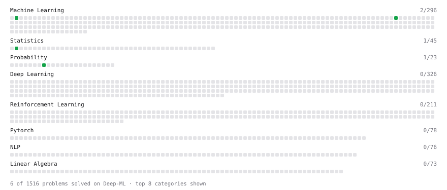

# Deep-ML

My machine learning practice from [Deep-ML](https://www.deep-ml.com). Every solution here was written by hand.

**7** solved · 5 problems · 0 labs · 2 math

[**Browse the interactive portfolio**](https://vanekay1378.github.io/deep-ml/) to replay this filling in over time.

## Problems

| | Difficulty | Solved | |
| --- | --- | --- | --- |
| [Calculate Portfolio Variance](https://www.deep-ml.com/problems/183) | easy | 2026-10-08 | [solution](problems/0183-calculate-portfolio-variance) |
| [Descriptive Statistics Calculator](https://www.deep-ml.com/problems/78) | easy | 2026-10-08 | [solution](problems/0078-descriptive-statistics-calculator) |
| [Gradient Direction and Magnitude](https://www.deep-ml.com/problems/308) | easy | 2026-10-06 | [solution](problems/0308-gradient-direction-and-magnitude) |
| [Linear Regression Using Gradient Descent](https://www.deep-ml.com/problems/15) | easy | 2026-10-07 | [solution](problems/0015-linear-regression-using-gradient-descent) |
| [Quotient Rule for Derivatives](https://www.deep-ml.com/problems/312) | medium | 2026-10-06 | [solution](problems/0312-quotient-rule-for-derivatives) |

## Math

| | Difficulty | Solved | |
| --- | --- | --- | --- |
| [Descriptive Statistics](https://www.deep-ml.com/math-problems/18) | easy | 2026-10-07 | [solution](math/0018-descriptive-statistics) |
| [Expectation and Variance Algebra](https://www.deep-ml.com/math-problems/33) | easy | 2026-10-07 | [solution](math/0033-expectation-and-variance-algebra) |

---

_This file is regenerated by Deep-ML on every push._
